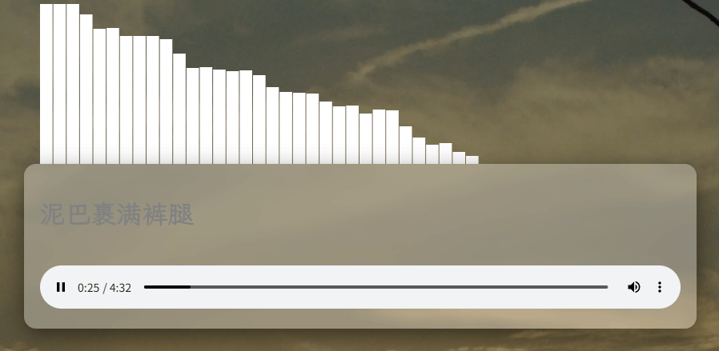
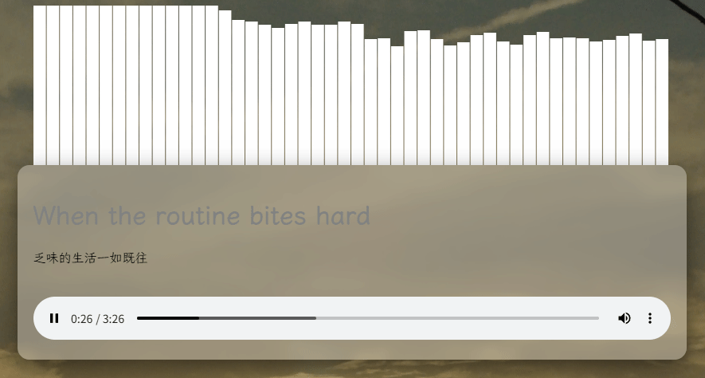
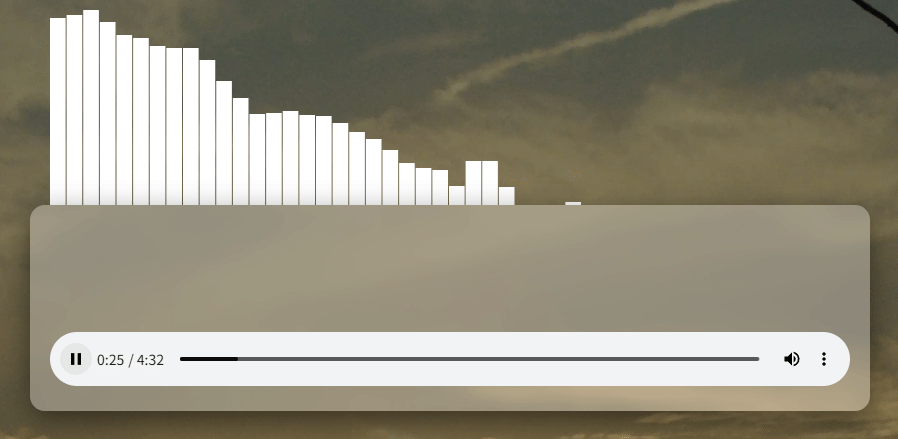
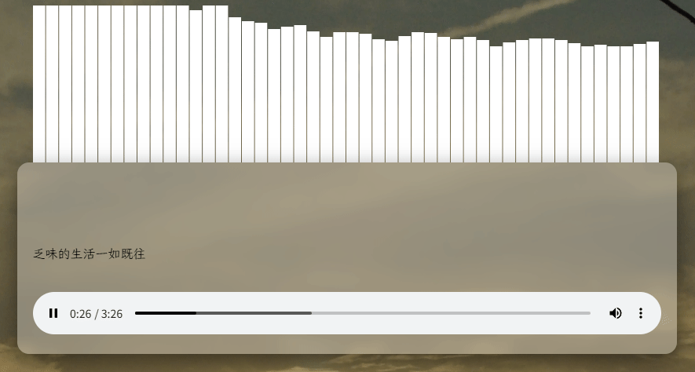

# Etmucis

一个简易支持卡拉ok和逐字（或词）淡入淡出效果的字幕音乐播放器

可按T键切换歌词显示模式

默认包含了一些歌曲和歌词

## 效果

共有两种效果，默认随机

### 卡拉OK(较大众)





### 淡出淡入(较小众)





两个歌曲分别是祖海的《为了谁》和Joy Division的《Love Will Tear Us Apart》

## 搭建

### 本地模式

在src/musicfile目录放入音乐音频文件，并放入同名（不包含扩展名）的lrc增强版歌词文件

并输入

```
npm run build
```

构建

此时网站应构建成功，根目录输出在dist文件夹

如果出现错误Error: You installed esbuild for another platform than the one you're currently using.

则您需要输入命令

```
npm rebuild esbuild
```

来重新安装esbuild依赖

### 网易云音乐模式（实验性功能）

在neteaseplaylist.txt中添加你的网易云音乐歌单链接或id（一行一个）

然后输入

```
npm run 163musicbuild
```

即可

## 在你的网站内使用

在网站内引用JS

```html
<script src="player.js"></script>
```

你需要确保你的网站包含以下css

```css
.lyric span {
    display: inline-block;
    background: linear-gradient(to right, #000000 var(--progress, 0%), #818282 var(--progress, 0%));
    -webkit-background-clip: text;
    background-clip: text;
    color: transparent;
    transition: --progress 0.1s ease;
	white-space: normal;
}
/*#000000与#818282分别是播放完与未播放的文字颜色*/
```

html

audio标签示例格式

```html
<audio id="audio" src="你的音乐文件路径" controls="" lyricpath="你的json歌词文件路径"></audio>
```

你需要在需要显示歌词的html文字标签使用id:lyric

并且包含class:lyric

副歌词（双语歌词）使用id:pairlyric

如果你想要实现频谱条效果，可以创建canvas
```html
<canvas id="spectrum" width="自定义" height="自定义"></canvas>
```

## 鸣谢 

[LxgwWenKai](https://github.com/lxgw/LxgwWenKai)等提供美观的字体

API提供：music.163.com，meting.qjqq.cn[Meting-API](https://github.com/injahow/meting-api)

所有指点/指导的人,包括但不限于：[RainView](https://github.com/RainView-ovo),[LeonspaceX](https://github.com/LeonspaceX),[Silvaire-qwq](https://github.com/silvaire-qwq),[Mio](https://mioical.moe/),[LYXOfficial](https://github.com/LYXOfficial),[Android-KitKat](https://github.com/Android-KitKat)

所包含的歌曲制作人


